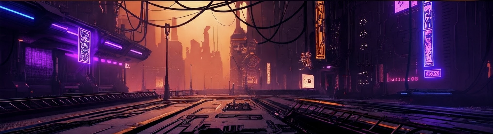

<b>Handsome Zebra</b>

<b>Lead DevOps Engineer</b>

<a href="https://ko-fi.com/handsomezebra" target="_blank"><svg fill="#0bceaf" width="24px" height="24px" viewBox="0 0 24 24" role="img" xmlns="http://www.w3.org/2000/svg"><path d="M23.881 8.948c-.773-4.085-4.859-4.593-4.859-4.593H.723c-.604 0-.679.798-.679.798s-.082 7.324-.022 11.822c.164 2.424 2.586 2.672 2.586 2.672s8.267-.023 11.966-.049c2.438-.426 2.683-2.566 2.658-3.734 4.352.24 7.422-2.831 6.649-6.916zm-11.062 3.511c-1.246 1.453-4.011 3.976-4.011 3.976s-.121.119-.31.023c-.076-.057-.108-.09-.108-.09-.443-.441-3.368-3.049-4.034-3.954-.709-.965-1.041-2.7-.091-3.71.951-1.01 3.005-1.086 4.363.407 0 0 1.565-1.782 3.468-.963 1.904.82 1.832 3.011.723 4.311zm6.173.478c-.928.116-1.682.028-1.682.028V7.284h1.77s1.971.551 1.971 2.638c0 1.913-.985 2.667-2.059 3.015z"/></svg></a>
<a rel="me" href="https://defcon.social/@handsomezebra"><svg fill="#0bceaf" width="24px" height="24px" viewBox="0 0 24 24" role="img" xmlns="http://www.w3.org/2000/svg"><path d="M23.193 7.879c0-5.206-3.411-6.732-3.411-6.732C18.062.357 15.108.025 12.041 0h-.076c-3.068.025-6.02.357-7.74 1.147 0 0-3.411 1.526-3.411 6.732 0 1.192-.023 2.618.015 4.129.124 5.092.934 10.109 5.641 11.355 2.17.574 4.034.695 5.535.612 2.722-.15 4.25-.972 4.25-.972l-.09-1.975s-1.945.613-4.129.539c-2.165-.074-4.449-.233-4.799-2.891a5.499 5.499 0 0 1-.048-.745s2.125.52 4.817.643c1.646.075 3.19-.097 4.758-.283 3.007-.359 5.625-2.212 5.954-3.905.517-2.665.475-6.507.475-6.507zm-4.024 6.709h-2.497V8.469c0-1.29-.543-1.944-1.628-1.944-1.2 0-1.802.776-1.802 2.312v3.349h-2.483v-3.35c0-1.536-.602-2.312-1.802-2.312-1.085 0-1.628.655-1.628 1.944v6.119H4.832V8.284c0-1.289.328-2.313.987-3.07.68-.758 1.569-1.146 2.674-1.146 1.278 0 2.246.491 2.886 1.474L12 6.585l.622-1.043c.64-.983 1.608-1.474 2.886-1.474 1.104 0 1.994.388 2.674 1.146.658.757.986 1.781.986 3.07v6.304z"/></svg></a>
<a href="https://www.linkedin.com/in/stephanielage/" target="_blank"><svg fill="#0bceaf" width="24px" height="24px" viewBox="0 0 24 24" xmlns="http://www.w3.org/2000/svg" data-name="Layer 1"><path d="M20.47,2H3.53A1.45,1.45,0,0,0,2.06,3.43V20.57A1.45,1.45,0,0,0,3.53,22H20.47a1.45,1.45,0,0,0,1.47-1.43V3.43A1.45,1.45,0,0,0,20.47,2ZM8.09,18.74h-3v-9h3ZM6.59,8.48h0a1.56,1.56,0,1,1,0-3.12,1.57,1.57,0,1,1,0,3.12ZM18.91,18.74h-3V13.91c0-1.21-.43-2-1.52-2A1.65,1.65,0,0,0,12.85,13a2,2,0,0,0-.1.73v5h-3s0-8.18,0-9h3V11A3,3,0,0,1,15.46,9.5c2,0,3.45,1.29,3.45,4.06Z"/></svg></a>
<a href="https://dev.to/thehandsomezebra/" target="_blank"><svg fill="#0bceaf" width="24px" height="24px" viewBox="0 0 32 32" xmlns="http://www.w3.org/2000/svg"><path d="M 2 7 L 2 25 L 30 25 L 30 7 L 2 7 z M 4 9 L 28 9 L 28 23 L 4 23 L 4 9 z M 6 11 L 6 21 L 9 21 C 10.654 21 12 19.654 12 18 L 12 14 C 12 12.346 10.654 11 9 11 L 6 11 z M 16 11 C 14.897 11 14 11.897 14 13 L 14 19 C 14 20.103 14.897 21 16 21 L 18 21 L 18 19 L 16 19 L 16 17 L 18 17 L 18 15 L 16 15 L 16 13 L 18 13 L 18 11 L 16 11 z M 19.691406 11 L 21.775391 20.025391 C 21.907391 20.595391 22.415 21 23 21 C 23.585 21 24.092609 20.595391 24.224609 20.025391 L 26.308594 11 L 24.255859 11 L 23 16.439453 L 21.744141 11 L 19.691406 11 z M 8 13 L 9 13 C 9.552 13 10 13.448 10 14 L 10 18 C 10 18.552 9.552 19 9 19 L 8 19 L 8 13 z"/></svg></a>

  
<b>💻 Skills & Technologies</b>

  

<b>☁️ Cloud & DevOps</b>

&nbsp;
&nbsp;
&nbsp;
&nbsp;
&nbsp;
&nbsp;
&nbsp;

  
<b>🏗️ Infrastructure as Code </b>

&nbsp;
&nbsp;
&nbsp;

  
<b>⚙️ CI/CD & Automation</b>

&nbsp;
&nbsp;
&nbsp;
&nbsp;
&nbsp;

  
<b>🛡️ Security & Observability</b>

&nbsp;
&nbsp;
&nbsp;
&nbsp;
&nbsp;
&nbsp;

  
<b>💻 Languages, Scripting & Web</b>

&nbsp;
&nbsp;
&nbsp;
&nbsp;
&nbsp;
&nbsp;
&nbsp;
&nbsp;
&nbsp;
&nbsp;
&nbsp;

  
<b>🏠 Home Lab & Self-Hosting</b>

&nbsp;
&nbsp;
&nbsp;
&nbsp;
&nbsp;
&nbsp;
&nbsp;
&nbsp;
&nbsp;
&nbsp;
&nbsp;

  
<b>⚙️ &nbsp;GitHub Statistics</b>

   
    

        
    

    

         
    

 

