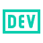

<b>Handsome Zebra</b>

<b>Lead DevOps Engineer</b>

  
<b>💻 Skills & Technologies</b>

  

<b>☁️ Cloud & DevOps</b>

&nbsp;
&nbsp;
&nbsp;
&nbsp;
&nbsp;
&nbsp;
&nbsp;

  
<b>🏗️ Infrastructure as Code </b>

&nbsp;
&nbsp;
&nbsp;

  
<b>⚙️ CI/CD & Automation</b>

&nbsp;
&nbsp;
&nbsp;
&nbsp;
&nbsp;

  
<b>🛡️ Security & Observability</b>

&nbsp;
&nbsp;
&nbsp;
&nbsp;
&nbsp;
&nbsp;

  
<b>💻 Languages, Scripting & Web</b>

&nbsp;
&nbsp;
&nbsp;
&nbsp;
&nbsp;
&nbsp;
&nbsp;
&nbsp;
&nbsp;
&nbsp;
&nbsp;

  
<b>🏠 Home Lab & Self-Hosting</b>

&nbsp;
&nbsp;
&nbsp;
&nbsp;
&nbsp;
&nbsp;
&nbsp;
&nbsp;
&nbsp;
&nbsp;
&nbsp;

  
<b>⚙️ &nbsp;GitHub Statistics</b>

   
    

        
    

    

         
    

 

